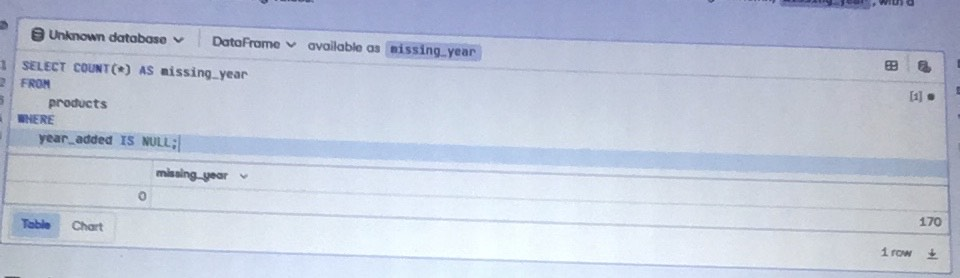
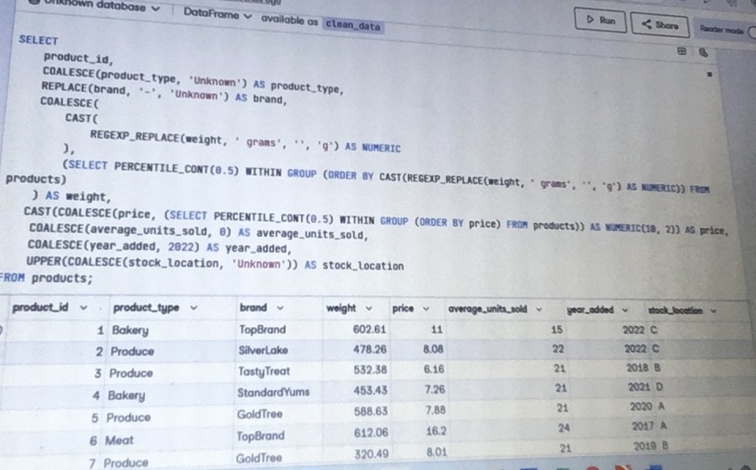

# Yum food-Sales-Analysis

This is a SQL project for the Sales Analysis of FoodYum. FoodYum is a grocery store chain that is based in the United States. 
Food Yum sells items such as produce, meat, dairy, baked goods, snacks, and other household food staples. As food costs rise, FoodYum wants to make sure it keeps stocking products in all categories that cover a range of prices to ensure they have stock for a broad range of customers. 

## Data Source

The dataset was gotten from Datacamp for my SQL certification practical exam and it's a CSV file.
The dataset contains records of customers for their last full year of the loyalty program.

The dataset has 8 columns with 1700 records which consists (ProductID, product_type, brand, weight, Price, average_units_sold, year_added, stock_location)

## Aims and Objectives 

# Task 1

1. They want to know how many products have the year_added value missing: Last year (2022) there was a bug in the product system. For some products that were added in that year, the year_added value was not set in the data. As the year the product was added may have an impact on the price of the product, this is important information to have.

 

 # Data Validation

 # Raw Data

 

# Cleaned Data

# Task 2 

 Given what you know about the year added data, you need to make sure all of the data is clean before you start your analysis. The table below shows what the data should look like.
 To ensure the product data matches the description provided. Do not update the original table. 

  

 # Task 3 

 FoodYum want to find out how the range varies for each product type, i was asked to determine the minimum and maximum values for each product type.

  

 # Task 4 

 The marketing team want to look in more detail at meat and dairy products where the average units sold was greater than ten.

  

 # Recommendations

 There's a need to consider factors such as marketing, promotions, or inventory management to capitalize on the success of meat and dairy products. The minimum and maximum price products should be used for setting competitive pricing strategies, understanding customer preferences, and making informed decisions about pricing adjustments.

It is essential to explore additional analyses, such as trends over time, seasonal variations, or correlations with external factors. This can provide deeper insights into customer behavior and help in making strategic business decisions.

 

 
